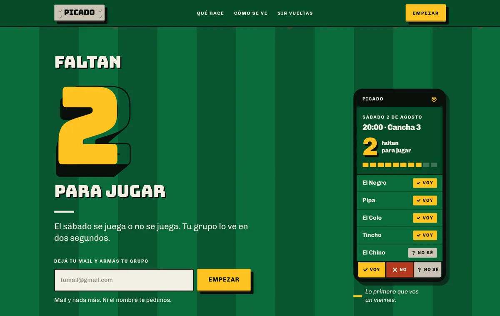
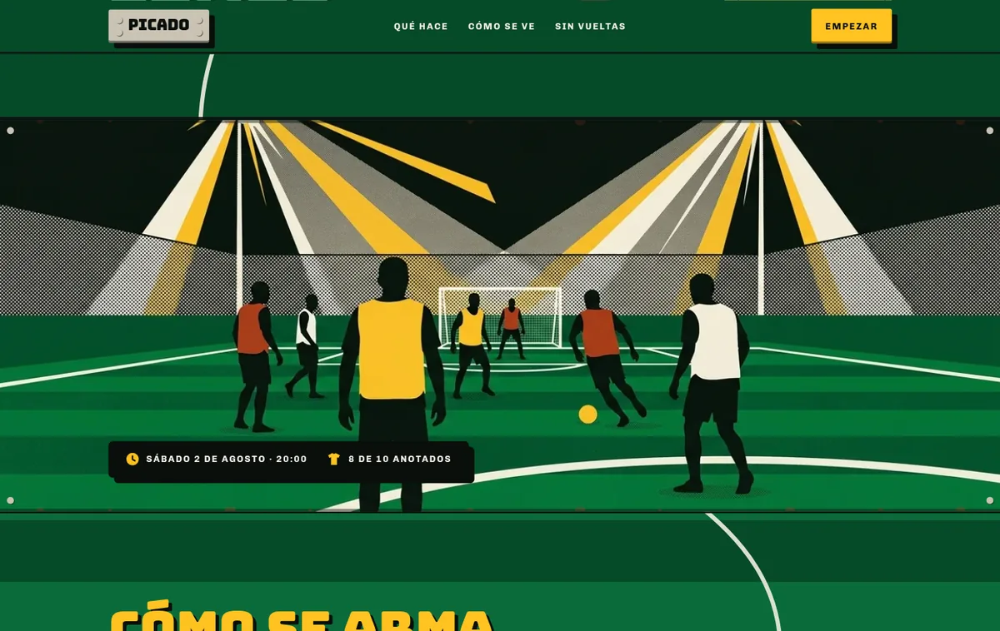

# PICADO

**Landing de presentación de una app que organiza los partidos de fútbol 5 de un grupo de amigos.**

> *In English: a fictional-brief design exercise. A mobile-first marketing landing for "PICADO", an app that answers one question — "are we ten or is there no match tonight?". Built with React 19, TypeScript and Tailwind 4, no UI kit and no icon library: every icon, illustration and motion behaviour is authored for this page. The brief, the brand and the content are invented.*





---

## Qué es esto, y qué no es

Es un **ejercicio de diseño y frontend**, hecho de punta a punta a partir de un brief ficticio: un tipo que organiza el picado de los sábados y no logra saber nunca si llegan a diez.

Para que no haya confusión:

- **La app no existe** y no va a existir. Esto es la landing que la promocionaría.
- **El brief, la marca, el grupo y los datos son inventados.** No hay cliente real detrás, ni usuarios, ni métricas.
- **No hay backend.** El formulario de lista de espera es visualmente completo y funcionalmente inerte, a propósito.
- Las pantallas de app que se ven en la página son **bocetos de diseño**, y la página los rotula como tales. No se afirma ninguna métrica, precio, testimonio ni cantidad de descargas.

Lo que sí es real es el laburo: la dirección de arte, el sistema de diseño, la implementación y las decisiones de accesibilidad.

## La decisión de diseño

El punto de partida fue rechazar la landing de app que trae la categoría de fábrica: hero centrado, celular flotando en perspectiva sobre un degradé y tres tarjetas iguales con iconito, título y párrafo.

La dirección elegida es **"el cartel de chapa del complejo"**: toda la superficie es el cartel esmaltado que cuelga en la entrada de una cancha de barrio. Chapa verde, letras de pincel amarillas con sombra dura, flechas de señalética vial, remaches en las esquinas, óxido en los bordes.

El motivo no es estético sino funcional. Un cartel de complejo existe para gritar **un número y una dirección desde treinta metros**, que es exactamente lo que hace el producto: decir cuántos van y cuántos faltan para diez. La forma sale del trabajo que el producto tiene que hacer.

De ahí bajan tres reglas duras que se sostienen en todo el código:

| Regla | Qué implica |
|---|---|
| **Tinta plana** | Cero degradés, cero glassmorphism, cero glow |
| **Sombra dura** | Todo `box-shadow` y `text-shadow` tiene `blur: 0`. Un blur mayor a cero es un bug, no una decisión |
| **El verde es la página** | El verde cancha llega siempre al borde de la ventana; nunca hay una sección de fondo claro |

El sistema completo —paleta, escala tipográfica, componentes, reglas con nombre— está documentado en [`DESIGN.md`](DESIGN.md). El contexto de producto está en [`PRODUCT.md`](PRODUCT.md).

## Lo que hay adentro

Ninguna de estas piezas viene de una librería:

**19 íconos dibujados a mano en SVG.** Silueta maciza, un color plano, sin trazo variable. No hay dependencia de íconos en el `package.json`. La gramática tiene una excepción con fundamento: lo que en el mundo real *es* una línea —la red del arco, las líneas de la cancha, un objeto tachado— se dibuja con línea, porque en silueta maciza un tachado se convierte en una mancha ilegible.

**El hilo de cal.** Un trazo SVG continuo que nace en la línea de fondo del primer viewport, serpentea hacia abajo cruzando todas las secciones y muere clavado en el botón del cierre. Los dos extremos están anclados al DOM (`data-hilo-inicio` / `data-hilo-fin`), no a coordenadas fijas: si el contenido cambia de alto, el trazo se recalcula solo. Se dibuja en coordenadas de página reales y no con `preserveAspectRatio="none"`, porque con el viewBox deformado el `dasharray` se mide en unidades del viewBox mientras el trazo se pinta en píxeles, y la línea se parte en fragmentos.

**Dos momentos de movimiento y nada más.** La cuenta regresiva del hero, con desaceleración exponencial, que sale del mecanismo del producto; y "el rodillo", una entrada por `clip-path` que descubre el contenido de izquierda a derecha como una pasada de pintura. Ambos respetan `prefers-reduced-motion`.

Dos reglas de implementación que salieron de errores reales durante el build y quedaron documentadas para que nadie las repita:

- **El contenido va primero.** El contenido es visible por defecto y el recorte lo agrega el JS en un layout effect, antes del primer pintado. Si el script no corre, la página se lee igual. Una animación no puede ser la condición para que el contenido exista.
- **El observado nunca es el recortado.** Un elemento con `clip-path` a ancho cero le reporta área cero al `IntersectionObserver`, así que jamás se lo considera visible y nunca se destaparía. Son dos elementos siempre.

## Accesibilidad

El requisito no es un estándar genérico: sale de un usuario concreto del brief, el padre del organizador, de 60 años, que usa WhatsApp y poco más. Si él no lo puede usar sin ayuda, está mal diseñado.

- Cuerpo mínimo de 17px y targets táctiles de 48px o más.
- Contraste AA verificado sobre el verde cancha. La jerarquía se hace con tamaño y peso, nunca bajando la opacidad del texto: sobre el rayado del césped, cualquier cal por debajo del 85% se cae del 4.5:1.
- El amarillo señalización sobre verde da 4.09:1, así que alcanza para letras grandes pero no para texto chico. Todo amarillo por debajo de 24px va sobre placa oscura.
- Sin menú hamburguesa. En mobile la barra deja marca y acción: un panel deslizante es exactamente la clase de vuelta que el usuario de referencia no maneja, y la página es corta.
- Link de salto al contenido, foco visible, y todo el movimiento anulado bajo `prefers-reduced-motion`.

## Stack

| | |
|---|---|
| React | 19 |
| TypeScript | 6 |
| Vite | 8 |
| Tailwind | 4 |
| Linter | oxlint |

Sin UI kit, sin librería de íconos, sin librería de animación.

## Correrlo

```bash
pnpm install
pnpm dev          # http://localhost:5173
```

```bash
pnpm build        # tsc -b && vite build
pnpm preview      # sirve el build
pnpm lint         # oxlint
```

## Estructura

```
src/
├── App.tsx              contrato de dirección + orden de secciones
├── data.ts              contenido de demostración (inventado, no son datos reales)
├── index.css            tokens del sistema y utilidades del cartel
├── sections/            una sección de página por archivo
├── components/
│   ├── Iconos.tsx       los 19 íconos SVG del sistema
│   ├── HiloDeCal.tsx    el trazo continuo que cruza la página
│   ├── movimiento.ts    los dos hooks de movimiento
│   ├── PantallasApp.tsx los bocetos de pantalla dentro del marco de celular
│   └── ui.tsx           primitivas compartidas
DESIGN.md                el sistema de diseño completo
PRODUCT.md               contexto de producto y del brief ficticio
```

## Licencia

MIT. Ver [`LICENSE`](LICENSE).
